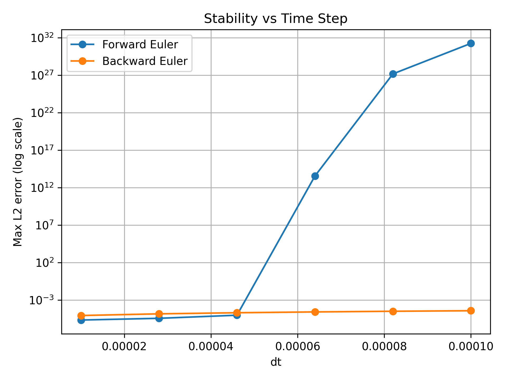
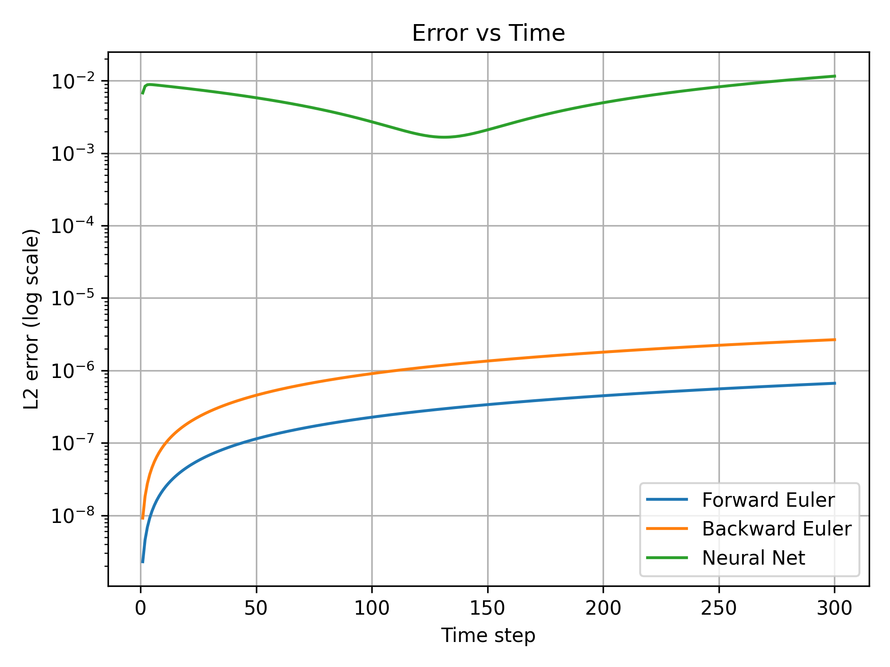

# Heat Equation Numerical Study

This project explores numerical and data-driven methods for solving the 1D heat equation:

$$
u_t = \alpha u_{xx}, \quad x \in [0,1]
$$

with zero boundary conditions and initial condition:

$$
u(x,0) = \sin(\pi x)
$$

## Overview

The project compares three approaches:

* Forward Euler (explicit finite difference)
* Backward Euler (implicit finite difference)
* A neural network trained to learn the time-stepping operator (u^n \rightarrow u^{n+1})

The goal is to study:

* Stability as a function of time step
* Error evolution over time
* Failure modes of learned time-stepping


## Project Structure

```
heat-equation-study/
│
├── src/
│   ├── core.py            # grid, initial condition, exact solution
│   ├── solvers.py         # Forward + Backward Euler implementations
│   ├── experiments.py     # runs simulations and saves results
│   ├── neural.py          # neural network + training
│   └── plotting.py        # generates figures
│
├── results/
│   ├── figures/           # output plots
│   └── data/              # saved simulation data (.npz)
│
├── report/
│   ├── report.tex
│   └── report.pdf
│
├── run.py                 # run experiments and plot results
└── environment.yml
```

## Setup

Create the environment using:

```
conda env create -f environment.yml
conda activate heat-equation-env
```

## Running Experiments

Run the full pipeline:

`python run.py`

This will:

* compute the exact solution
* run Forward and Backward Euler solvers
* perform a stability sweep over time step size
* train a neural network on Backward Euler data
* generate and save results to `results/data/`

## Outputs

The pipeline generates:

* error vs time (FE, BE, NN)
* stability vs time step
* neural network vs Backward Euler comparison
* plots stored in `results/figures/`

## Sample Results

### Stability vs Time Step
<p align="center">
  
</p>

### Error vs Time
<p align="center">
  
</p>


## Report

The report found in `report/report.pdf` summarises:

* numerical stability behaviour
* comparison between solvers
* limitations of the neural network approach

## Notes

* Forward Euler is conditionally stable and diverges for large time steps ($\alpha \dfrac{\Delta t}{\Delta x^2} \gt \dfrac{1}{2}$).
* Backward Euler is unconditionally stable, remaining stable for all tested time steps.
* The neural network achieves accurate one-step prediction but shows structured, non-monotone error evolution under autoregressive rollout (visible in log-error plots).

This is an exploratory project focused on understanding stability and learned time-stepping rather than optimising performance.
